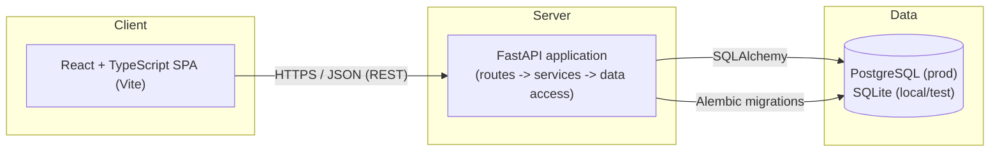

# PayScope — Technical Architecture

This document describes the technical architecture for the initial version of
PayScope, based on the requirements defined in
[`requirements.md`](./requirements.md). It covers system structure,
technology choices, backend and frontend organization, database design
principles, API conventions, testing strategy, and operational concerns.

This is a documentation-only artifact. No application code, database models,
migrations, or dependencies are created as part of this document.

---

## 1. Architecture Overview

PayScope is a single-application, two-tier system: a React single-page
frontend communicating with a FastAPI backend over HTTP/JSON, backed by a
relational database.

* **Frontend (React + TypeScript + Vite)** renders the UI, sends requests to
  the backend for employee data, search, filters, pagination, and analytics,
  and displays the results.
* **Backend (FastAPI)** exposes a REST API, applies validation and business
  logic, and is the only component that talks to the database.
* **Database (PostgreSQL in production, SQLite for local dev/tests)** stores
  employee and salary records.

The frontend never accesses the database directly. All data access is
mediated by the backend API, which keeps validation, authorization, and
currency-handling rules in one place.

### 1.1 Frontend–Backend Communication

The frontend communicates with the backend exclusively via a REST API over
HTTPS (HTTP in local development), exchanging JSON. The frontend does not
embed business rules such as filtering logic or salary aggregation — it
sends the user's search/filter/pagination intent as query parameters and
renders whatever the backend returns.

### 1.2 Backend–Database Communication

The backend communicates with the database through SQLAlchemy, using it as
the single data-access layer. Schema evolution is managed through Alembic
migrations. No other component connects to the database.

### 1.3 Supporting ~10,000 Employees

At the target scale of approximately 10,000 employee records, the system is
kept simple by design:

* All listing, search, filtering, and pagination happen **server-side** via
  SQL queries — the full dataset is never loaded into the API process memory
  or sent to the client in one payload.
* Appropriate **indexes** (Section 6) keep search/filter queries fast at this
  volume without requiring a search engine or caching layer.
* Analytics (aggregations) are computed via SQL aggregate queries
  (`COUNT`, `AVG`, `MIN`, `MAX` with `GROUP BY`) rather than in application
  code, so the database — not the API process — does the heavy lifting.

This scale does not warrant sharding, read replicas, caching layers, or a
microservices split; a single backend service and a single relational
database are sufficient and are what this document assumes.

### 1.4 High-Level Diagram



---

## 2. Technology Decisions

| Technology | Purpose | Rationale |
|---|---|---|
| **Python** | Backend implementation language | Widely used for data-oriented backends; strong ecosystem for API and database tooling. |
| **FastAPI** | Web framework / API layer | Built-in request/response validation via Pydantic, automatic OpenAPI docs, async support, and a straightforward routing model — no extra API-schema framework needed. |
| **SQLAlchemy** | ORM / data-access layer | Mature, explicit ORM that maps well to a relational model of employees and salaries; supports both PostgreSQL and SQLite with the same codebase. |
| **Alembic** | Database migrations | Standard migration tool for SQLAlchemy; gives a versioned, repeatable schema history instead of manual schema changes. |
| **Pydantic** | Request/response schema validation | Integrates natively with FastAPI; defines a single source of truth for what a valid request/response looks like, avoiding hand-written validation code. |
| **PostgreSQL** | Production database | Relational database with strong support for indexing, constraints, and aggregate queries — a good fit for structured employee/salary data and grouped analytics. |
| **SQLite** | Local development / test database | Zero-setup, file-based database that lets developers and CI run the same SQLAlchemy models without provisioning a server; used only where the SQL feature set required is compatible with production behavior. |
| **React** | Frontend UI library | Component-based UI, well suited to a data-table-and-filters style application; broad ecosystem and hiring-independent familiarity. |
| **TypeScript** | Frontend language | Static typing catches shape mismatches between API responses and UI code, which matters when consuming a typed backend API. |
| **Vite** | Frontend build tool | Fast local dev server and build pipeline with minimal configuration, avoiding heavier bundler setups that add no value at this project's size. |
| **Pytest** | Backend test framework | Standard Python test runner with fixtures, well suited to unit and integration tests of services and data access. |
| **HTTPX** | Backend API testing | Works with FastAPI's test client model to exercise real HTTP request/response cycles against the API layer, including status codes and error shapes. |
| **Vitest** | Frontend test framework | Vite-native test runner, avoiding a separate/parallel build configuration for tests. |

No additional frameworks (e.g. task queues, caching servers, search engines,
GraphQL layers, or state-management libraries) are introduced, as they are
not required to meet the stated requirements at the target scale.

---

## 3. Proposed Project Structure

Structure only — no folders or files are created by this document.

```
salary-management/
├── README.md
├── docs/
│   ├── requirements.md
│   └── architecture.md
│
├── backend/
│   ├── app/
│   │   ├── main.py                  # FastAPI app creation, router registration
│   │   ├── api/
│   │   │   └── v1/
│   │   │       ├── routes/
│   │   │       │   ├── employees.py     # Employee list/detail/search/filter routes
│   │   │       │   └── analytics.py     # Salary analytics routes
│   │   │       └── dependencies.py      # Shared FastAPI dependencies (e.g. DB session, pagination params)
│   │   ├── services/
│   │   │   ├── employee_service.py      # Business logic for employee queries
│   │   │   └── analytics_service.py     # Business logic for salary aggregation
│   │   ├── models/
│   │   │   ├── employee.py              # SQLAlchemy model
│   │   │   └── salary.py                # SQLAlchemy model
│   │   ├── schemas/
│   │   │   ├── employee.py              # Pydantic request/response schemas
│   │   │   └── analytics.py             # Pydantic response schemas for analytics
│   │   ├── db/
│   │   │   ├── base.py                  # Declarative base, shared metadata
│   │   │   └── session.py               # Engine/session factory, DB session dependency
│   │   ├── core/
│   │   │   ├── config.py                # Environment-driven settings
│   │   │   └── errors.py                # Shared exception types + error response shaping
│   │   └── utils/
│   │       └── pagination.py            # Shared pagination helpers used by services/routes
│   ├── alembic/
│   │   ├── versions/                    # Migration scripts
│   │   └── env.py
│   ├── tests/
│   │   ├── conftest.py                  # Shared fixtures (test DB, test client, seed data)
│   │   ├── unit/
│   │   │   ├── test_employee_service.py
│   │   │   └── test_analytics_service.py
│   │   └── api/
│   │       ├── test_employees_api.py
│   │       └── test_analytics_api.py
│   ├── alembic.ini
│   └── pyproject.toml
│
└── frontend/
    ├── src/
    │   ├── pages/
    │   │   ├── EmployeeListPage.tsx     # Search/filter/pagination page
    │   │   └── AnalyticsPage.tsx        # Salary analytics page
    │   ├── components/
    │   │   ├── employee/
    │   │   │   ├── EmployeeTable.tsx
    │   │   │   └── EmployeeFilters.tsx
    │   │   ├── analytics/
    │   │   │   └── SalarySummaryCard.tsx
    │   │   └── common/
    │   │       ├── Pagination.tsx
    │   │       ├── LoadingState.tsx
    │   │       ├── EmptyState.tsx
    │   │       └── ErrorState.tsx
    │   ├── api/
    │   │   ├── client.ts                 # Shared fetch/HTTP client (base URL, error handling)
    │   │   ├── employees.ts              # Employee-related API calls
    │   │   └── analytics.ts              # Analytics-related API calls
    │   ├── types/
    │   │   ├── employee.ts               # Shared TypeScript types mirroring backend schemas
    │   │   └── analytics.ts
    │   ├── hooks/
    │   │   └── useEmployeeQuery.ts       # Shared data-fetching + loading/error state hook
    │   └── utils/
    │       └── formatting.ts             # Shared currency/number formatting helpers
    ├── tests/
    │   ├── components/
    │   │   └── EmployeeTable.test.tsx
    │   └── api/
    │       └── employees.test.ts
    ├── index.html
    ├── package.json
    └── vite.config.ts
```

Key structural principles:

* **Routes stay thin.** Route handlers in `api/v1/routes/` parse
  request/query parameters (via Pydantic/FastAPI) and delegate to
  `services/`; they do not contain business logic themselves.
* **Services hold business logic.** Filtering rules, currency-scoping rules,
  and aggregation logic live in `services/`, independent of the HTTP layer,
  so they can be unit-tested without spinning up the API.
* **Shared logic is centralized**, not duplicated: pagination helpers,
  currency formatting, error shaping, and the frontend API client are each
  defined once and imported wherever needed.

---

## 4. Backend Architecture

### 4.1 API Route Organization

Routes are grouped by resource under a versioned prefix (`/api/v1/...`), e.g.
`employees.py` for employee listing/search/filter/detail, and
`analytics.py` for salary analytics. Each route module is responsible only
for: parsing/validating input (via Pydantic schemas and FastAPI query
parameters), calling the corresponding service function, and returning the
service's result as a response schema.

### 4.2 Service Layer Responsibilities

The service layer (`services/`) contains the business logic that routes
delegate to:

* Translating search/filter/pagination parameters into database queries.
* Enforcing currency-scoping rules for analytics (Section 6.6).
* Computing aggregate salary statistics.
* Raising domain-level errors (e.g. "employee not found") that the API layer
  translates into HTTP responses.

Services depend on the data-access layer (SQLAlchemy models/sessions) but
are not themselves aware of HTTP concerns (status codes, request objects),
which keeps them reusable and independently testable.

### 4.3 Data-Access Approach

SQLAlchemy models (`models/`) define the relational structure (Section 6).
Services query through SQLAlchemy's ORM/Core query interface rather than raw
SQL, keeping queries composable (e.g. building up filters conditionally) and
portable between PostgreSQL and SQLite. Raw SQL is avoided unless a specific
query cannot be reasonably expressed via the ORM.

### 4.4 Database Session Management

A single session-factory pattern is used: `db/session.py` creates a
SQLAlchemy engine/sessionmaker from configuration, and a FastAPI dependency
(`Depends(get_db)`) provides a request-scoped session to routes/services.
Sessions are opened per request and closed automatically at the end of the
request, avoiding shared or long-lived sessions across requests.

### 4.5 Pydantic Schema Usage

Pydantic schemas (`schemas/`) define the shape of API requests and
responses, separate from SQLAlchemy models (`models/`). This separation
means:

* Internal database structure can evolve without automatically changing the
  public API shape.
* Input validation (required fields, numeric/non-negative salary, allowed
  currency codes) is expressed declaratively in one place and reused by
  FastAPI automatically.

### 4.6 Validation

Validation happens at two levels:

* **Schema-level** (Pydantic): type correctness, required fields, basic
  constraints (e.g. non-negative salary, currency code format) — matches
  FR-7.1–FR-7.3 in the requirements document.
* **Service-level**: rules that depend on business context or the database
  (e.g. rejecting an unsupported currency code against a known set), where a
  Pydantic field validator alone is insufficient.

### 4.7 Error Handling

A small set of domain exceptions (defined in `core/errors.py`), all
subclasses of a common `AppError` base (carrying a `code`, `message`,
optional `details`, and the HTTP status to respond with) — e.g.
`NotFoundError` (404), `ValidationError` (422, for application-level checks
a Pydantic schema alone can't express, such as an unsupported `sort_by`
value) — are raised by routes/services and translated by a FastAPI
exception handler into a **consistent JSON error response** (Section 7.5).
Three further handlers extend the same response shape to cases outside
`AppError`: FastAPI/Starlette's own `HTTPException` (e.g. an unmatched
route), `RequestValidationError` (Pydantic query/path parameter validation
failures, with per-field location/message/type in `details`), and a
catch-all for any other unhandled exception, which is logged server-side
(Python's standard `logging` module; no separate logging framework) and
reduced to a generic `500` response. This avoids scattering `try/except`
and ad-hoc error formatting across route handlers, and ensures internal
details (stack traces, raw exception messages, database errors) are never
returned to the client, only logged server-side (FR-8.3, FR-8.4).

---

## 5. Frontend Architecture

### 5.1 Page Organization

Pages (`pages/`) correspond to top-level views: an employee list page
(search, filter, pagination) and an analytics page. Pages compose reusable
components and hooks rather than containing rendering and data-fetching
logic inline.

### 5.2 Reusable Components

Presentational components (`components/common/`) such as `Pagination`,
`LoadingState`, `EmptyState`, and `ErrorState` are shared across pages to
avoid duplicating loading/empty/error UI logic. Domain components
(`components/employee/`, `components/analytics/`) render employee/salary
data but do not themselves fetch data — they receive data and callbacks via
props.

### 5.3 API Client Structure

All HTTP calls go through a small shared client (`api/client.ts`) that
centralizes the base URL, request/response JSON handling, and error
normalization (mapping the backend's consistent error shape into a
predictable client-side error object). Resource-specific modules
(`api/employees.ts`, `api/analytics.ts`) build on this shared client rather
than each implementing their own `fetch` logic, avoiding duplicated request
handling.

### 5.4 State Management Approach

No dedicated state-management library (e.g. Redux) is introduced. The
application's state is primarily **server data plus local UI state**
(current search term, active filters, current page), which fits React's
built-in `useState`/`useEffect`, wrapped in a small shared data-fetching hook
(`hooks/useEmployeeQuery.ts`) that encapsulates loading/error/data state for
a given query. This is sufficient because:

* There is no complex client-only state shared across unrelated parts of the
  UI.
* Server state (employee list, analytics) is fetched per-view and does not
  need cross-page synchronization in the initial version.

If future requirements introduce more complex client state or caching needs
(e.g. optimistic updates, cross-page cache sharing), that would be a
documented decision at that time, not a default.

### 5.5 Loading, Empty, and Error States

Every data-driven view handles three explicit states, produced by the
shared fetching hook and rendered via the shared `LoadingState`,
`EmptyState`, and `ErrorState` components:

* **Loading**: request in flight.
* **Empty**: request succeeded but returned zero matching records (distinct
  from an error, per FR-8.2).
* **Error**: request failed; a user-readable message is shown, sourced from
  the normalized client-side error, never a raw technical error.

### 5.6 Search and Filter Handling

Search text and filter selections (department, country, salary range) are
held as local component/page state, translated into query parameters by the
API client modules, and sent to the backend on each change (typically
debounced for free-text search). The frontend does not filter or search
data client-side — all matching happens server-side, consistent with the
"server-side pagination/filtering" principle in Section 1.3.

### 5.7 Separation of Presentation and Business Logic

"Business logic" on the frontend is limited to request/response shaping and
UI-state decisions (e.g. what to render for a given state). Domain rules
(what counts as a match, how analytics are computed, currency-scoping rules)
live entirely in the backend; the frontend renders what the API returns
without re-deriving domain logic, avoiding duplicated logic between frontend
and backend.

---

## 6. Database Design Principles

No models or migrations are created here; this section documents the
intended relational approach.

### 6.1 Relational Approach

PostgreSQL (production) and SQLite (local/test) are used via the same
SQLAlchemy models, so schema and query logic stay consistent across
environments. SQLite is used only where its SQL feature set is sufficient
for the queries involved (see 6.7); it is not used in a way that would let
production-only behavior go untested.

### 6.2 Employee and Salary Data Separation

Employee identity/attributes (name, department, country, job title,
employment status) and salary information (amount, currency) are modeled as
**separate tables** (`employees`, `salaries`) with a relationship between
them, rather than one wide table. This reflects the requirements document's
treatment of "employee information" and "salary information" as distinct
concerns (Sections 3.1–3.2 of `requirements.md`) and keeps salary-specific
concerns (currency, validation) isolated from general employee attributes.

### 6.3 Primary and Foreign Keys

* Each table uses a surrogate primary key (e.g. an auto-generated ID).
* `salaries` references `employees` via a foreign key, reflecting the
  one-active-salary-per-employee assumption in the requirements document
  (Section 3.2 / Assumptions).

### 6.4 Indexing for Search and Filtering

To keep search/filter/pagination performant at ~10,000 records:

* Indexes on columns used for filtering: `department`, `country`.
* An index (or database text-search feature) supporting name-based search.
* An index on the salary amount/currency where range filtering is common.
* Foreign key columns (e.g. `salaries.employee_id`) are indexed by default
  via the foreign key constraint in PostgreSQL.

### 6.5 Alembic Migration Strategy

Alembic manages schema changes as an ordered set of versioned migration
scripts under `backend/alembic/versions/`. Each schema change (e.g. adding a
column, adding an index) is one migration, applied the same way in every
environment, avoiding manual/ad-hoc schema drift between development,
testing, and production.

### 6.6 Currency-Specific Salary Storage

Consistent with Section 5 of `requirements.md`:

* Every salary record stores an explicit currency code alongside the
  amount; currency is a required, non-defaulted field.
* No column or process assumes a single implicit currency across all
  employees.

### 6.7 Avoiding Direct Aggregation Across Currencies

Aggregation queries (used by the analytics service) always group by, or
filter to, a single currency before computing `SUM`/`AVG`/`MIN`/`MAX`. The
database layer does not expose a query path that aggregates raw amounts
across mixed currencies. Cross-currency reporting is out of scope for the
initial version (per `requirements.md` Section 6.2) and is not implemented
at the database level either — it is not "faked" by summing regardless of
currency.

---

## 7. API Design Principles

No endpoints are implemented here; this section documents conventions.

### 7.1 REST Conventions

Resources are modeled as nouns (`/employees`, `/analytics/salary`) with
standard HTTP methods (`GET` for the initial, read-oriented version, per
`requirements.md` Section 6.2). Query parameters express search, filters,
and pagination rather than encoding them into the path.

### 7.2 Request and Response Validation

All request query parameters and response bodies are defined as Pydantic
schemas (Section 4.5), giving FastAPI-generated validation and OpenAPI
documentation for free, and ensuring a single definition of each shape is
reused across the codebase rather than re-validated ad hoc per route.

### 7.3 Pagination

List endpoints accept `page`/`page_size`-style query parameters (or
equivalent offset/limit) and return the page of results together with
metadata (total count and/or total pages), per FR-5.1–FR-5.4. Pagination
parameters and metadata are defined once (shared schema/util) and reused by
any endpoint that returns a list.

### 7.4 Search and Filtering

Search and filter parameters (name/ID search; department, country, salary
range filters) are accepted as query parameters on the employee list
endpoint and combined server-side (FR-3.x, FR-4.x). Filter-building logic is
implemented once in the service layer and reused rather than duplicated
between, e.g., the list endpoint and any future export endpoint.

### 7.5 Consistent Error Response Structure

All error responses share a single JSON shape, `{"error": {"code": ...,
"message": ..., "details": ...}}`, produced by shared FastAPI exception
handlers (Section 4.7) rather than being formatted individually per route.
`code` is a stable, machine-readable string (e.g. `EMPLOYEE_NOT_FOUND`,
`VALIDATION_ERROR`); `message` is a human-readable description; `details`
is `null` for most errors and a structured payload (e.g. a list of
field-level validation failures) where useful. Common status codes: `404`
for a missing resource, `422` for request validation and other rejected
input, `500` for an unexpected failure (with a generic message; specifics
are logged server-side only, never returned). This supports FR-8.1–FR-8.3
and lets the frontend's API client handle all errors uniformly
(Section 5.3).

### 7.6 API Versioning Approach

Routes are namespaced under `/api/v1/` from the start. This does not imply
multiple versions exist yet — it simply reserves the ability to introduce a
`/v2` in the future (e.g. if cross-currency reporting requires a breaking
response shape change) without disrupting existing clients.

### 7.7 Avoiding Duplicate API Logic

Cross-cutting concerns — pagination parsing, error shaping, currency
formatting/validation — are implemented once (in `utils/`, `core/`, and
shared schemas) and imported by every route/service that needs them,
rather than reimplemented per endpoint.

---

## 8. Testing Strategy

* **Unit tests** (`backend/tests/unit/`): test service-layer functions
  (filtering logic, analytics calculations, currency-scoping rules) in
  isolation from HTTP, using a test database session.
* **Integration tests**: exercise a service together with the real
  data-access layer (SQLAlchemy models against a test database), verifying
  queries behave correctly end-to-end within the backend.
* **API tests** (`backend/tests/api/`): use HTTPX against the FastAPI app to
  test full request/response cycles, including status codes, response
  shapes, and error responses (Section 7.5).
* **Frontend component tests** (`frontend/tests/components/`): use Vitest
  (with a component-testing utility) to test rendering of loading/empty/
  error states and correct display of employee/salary data, and to test the
  API client modules' request/response handling in isolation.
* **Validation tests**: specifically target Pydantic schema validation
  (e.g. rejecting negative salaries, missing required fields, invalid
  currency codes), corresponding to FR-7.1–FR-7.4.
* **Shared fixtures and test utilities**: a shared `conftest.py` provides a
  test database session and seeded sample data used by unit, integration,
  and API tests, so test setup (creating a test DB, seeding employees) is
  written once and reused, avoiding per-test duplication.

---

## 9. Scalability and Performance

* **Pagination** ensures no single request returns the full ~10,000-record
  dataset; page size is bounded (Section 7.3).
* **Database indexes** (Section 6.4) keep filter/search queries efficient at
  this volume without requiring a dedicated search engine.
* **Efficient search and filtering** is achieved by translating filters
  directly into SQL `WHERE` clauses via SQLAlchemy, evaluated by the
  database rather than in application code.
* **Avoiding N+1 queries**: where an endpoint needs related data (e.g. an
  employee and their salary), the service layer uses SQLAlchemy joins/eager
  loading to fetch related rows in a single query rather than issuing one
  query per employee.
* **Aggregation performance**: analytics are computed via SQL `GROUP BY`
  and aggregate functions, executed by the database, which is efficient at
  the target scale without an application-level aggregation step.
* **Future dataset growth**: if the dataset grows well beyond ~10,000
  employees, options such as additional indexing, query optimization, or
  read replicas can be considered at that time; none of these are
  introduced prematurely in the initial version.

---

## 10. Security Considerations

* **Input validation**: all client input (query parameters, request bodies)
  is validated via Pydantic schemas before reaching business logic or the
  database, reducing injection and malformed-data risk (Section 4.6).
* **Authentication and authorization**: the API is designed to sit behind
  an authentication requirement (per NFR in `requirements.md` Section 4.4),
  but the specific mechanism is **not implemented** in this initial
  architecture; routes are structured so an authentication dependency can be
  added centrally (e.g. as a FastAPI dependency applied to the router)
  without restructuring business logic.
* **Sensitive salary information**: salary data is treated as sensitive
  throughout — it is only ever returned through authenticated API responses
  (once authentication is added) and is never written to logs (see below).
* **Environment variables and secrets**: configuration such as database
  connection strings is read from environment variables via
  `core/config.py`, not hard-coded, and secrets are not committed to the
  repository.
* **Secure configuration**: production configuration (e.g. PostgreSQL
  credentials, allowed CORS origins) is environment-specific and kept out of
  source control; local development uses safe local defaults (e.g. SQLite,
  permissive local CORS).
* **Avoiding sensitive information in logs**: error logging (Section 4.7)
  logs error context (type, request path, timestamp) but does not log full
  request bodies or salary values, to avoid leaking sensitive data into log
  storage.

---

## 11. Development

* **Local development**: backend runs via `uvicorn` against a local SQLite
  database (or a local PostgreSQL instance, if preferred) for fast
  iteration; frontend runs via the Vite dev server, which proxies API
  requests to the local backend.
* **Environment configuration**: environment-specific values (database URL,
  API base URL for the frontend, CORS origins) are provided via environment
  variables, read through a single configuration module on each side
  (`core/config.py` on the backend; Vite's `import.meta.env` on the
  frontend), rather than scattered `os.environ` / hard-coded reads.
* **Database configuration**: local/test environments default to SQLite for
  zero-setup iteration; PostgreSQL is used where production-equivalent
  behavior needs to be verified. The same SQLAlchemy models and Alembic
  migrations apply to both, so schema changes are exercised consistently
  across environments.
* **Testing workflow**: backend tests (Pytest/HTTPX) run against a
  dedicated test database (SQLite or a disposable PostgreSQL instance);
  frontend tests (Vitest) run independently against component/unit-level
  concerns. Both are expected to run locally and in CI before merging a
  change.

---

## 12. Engineering Decisions and Trade-offs

| Decision | Selected Approach | Reason | Trade-off / Limitation |
|---|---|---|---|
| Backend framework | FastAPI | Native Pydantic integration, async support, auto-generated API docs | Smaller plugin ecosystem than Django for things like an admin panel (not needed here) |
| Data access | SQLAlchemy ORM (no raw SQL by default) | Composable, testable queries; portable across PostgreSQL/SQLite | Slightly more overhead than hand-written SQL for very complex queries (not expected at this scale) |
| Local/test database | SQLite | Zero-setup for developers and CI | Minor SQL feature differences vs. PostgreSQL must be considered when writing queries |
| Production database | PostgreSQL | Strong indexing/aggregation support, proven at this data scale | Requires a managed/provisioned instance in production |
| Employee/salary modeling | Separate tables with a foreign key | Matches conceptual separation in requirements; isolates currency/validation concerns | One additional join for combined employee+salary views |
| Currency handling | Store currency per salary record; aggregate only within a single currency | Prevents incorrect cross-currency totals (Section 5 of requirements) | No unified cross-currency reporting figure in the initial version |
| Pagination/filtering location | Server-side (SQL-level) | Keeps client payloads small and scalable to ~10,000 records | Requires network round-trip per page/filter change |
| Frontend state management | React built-in state + a small shared fetching hook | No cross-page shared/complex client state exists yet | Would need revisiting if requirements introduce complex client-side caching |
| API versioning | `/api/v1/` prefix from the start | Cheap to add now; avoids a breaking change later | No functional benefit until a `/v2` is actually needed |
| Authentication | Designed for, not implemented | Out of scope for this document per current instructions | API is not yet access-controlled; must be added before production use |
| Infrastructure complexity | Single backend service, single database, no caching/microservices | Matches actual scale (~10,000 employees) | Would need re-evaluation if scale or requirements grow substantially |

---

## Review Notes (Consistency Check)

* Terminology (HR manager, employee information, salary information,
  currency-specific summaries, cross-currency reporting) is reused directly
  from `requirements.md` rather than introducing new terms for the same
  concepts.
* This document does not restate the functional/non-functional requirements
  themselves; it references them (e.g. "FR-5.1–FR-5.4") to avoid duplicating
  or risking contradiction with `requirements.md`.
* Cross-currency reporting is consistently treated as out of scope at every
  layer touched (database aggregation, service layer, API, frontend
  analytics view), avoiding a mismatch where one layer implies it is
  supported.
* No unnecessary complexity is introduced: no caching layer, no
  microservices, no state-management library, and no authentication
  implementation are added, consistent with the stated constraints for this
  initial version.
* Potential duplicated responsibility that this structure specifically
  avoids: pagination logic (one shared utility, not per-endpoint),
  validation (Pydantic schemas as the single source, not re-validated in
  services), and API request handling on the frontend (one shared client,
  not per-component `fetch` calls).
