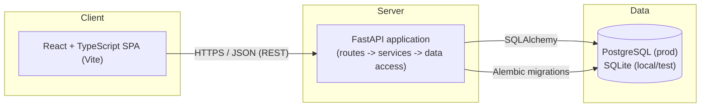

# PayScope — Technical Architecture

This document describes the technical architecture of PayScope, based on the
requirements defined in [`requirements.md`](./requirements.md). It covers
system structure, technology choices, backend and frontend organization,
authentication, database design, API conventions, testing strategy, and
operational concerns, and reflects the application as implemented in this
repository.

---

## 1. Architecture Overview

PayScope is a single-application, two-tier system: a React single-page
frontend communicating with a FastAPI backend over HTTP/JSON, backed by a
relational database.

* **Frontend (React + TypeScript + Vite)** renders the UI, sends requests to
  the backend for employee data, search, filters, pagination, and analytics,
  and displays the results.
* **Backend (FastAPI)** exposes a REST API, applies validation and business
  logic, and is the only component that talks to the database.
* **Database (PostgreSQL in production, SQLite for local dev/tests)** stores
  employee and salary records.

The frontend never accesses the database directly. All data access is
mediated by the backend API, which keeps validation, authorization, and
currency-handling rules in one place.

### 1.1 Frontend–Backend Communication

The frontend communicates with the backend exclusively via a REST API over
HTTPS (HTTP in local development), exchanging JSON. The frontend does not
embed business rules such as filtering logic or salary aggregation — it
sends the user's search/filter/pagination intent as query parameters and
renders whatever the backend returns.

### 1.2 Backend–Database Communication

The backend communicates with the database through SQLAlchemy, using it as
the single data-access layer. Schema evolution is managed through Alembic
migrations. No other component connects to the database.

### 1.3 Supporting ~10,000 Employees

At the target scale of approximately 10,000 employee records, the system is
kept simple by design:

* All listing, search, filtering, and pagination happen **server-side** via
  SQL queries — the full dataset is never loaded into the API process memory
  or sent to the client in one payload.
* Appropriate **indexes** (Section 6) keep search/filter queries fast at this
  volume without requiring a search engine or caching layer.
* Analytics (aggregations) are computed via SQL aggregate queries
  (`COUNT`, `AVG`, `MIN`, `MAX` with `GROUP BY`) rather than in application
  code, so the database — not the API process — does the heavy lifting.

This scale does not warrant sharding, read replicas, caching layers, or a
microservices split; a single backend service and a single relational
database are sufficient and are what this document assumes.

### 1.4 High-Level Diagram



---

## 2. Technology Decisions

| Technology | Purpose | Rationale |
|---|---|---|
| **Python** | Backend implementation language | Widely used for data-oriented backends; strong ecosystem for API and database tooling. |
| **FastAPI** | Web framework / API layer | Built-in request/response validation via Pydantic, automatic OpenAPI docs, async support, and a straightforward routing model — no extra API-schema framework needed. |
| **SQLAlchemy** | ORM / data-access layer | Mature, explicit ORM that maps well to a relational model of employees and salaries; supports both PostgreSQL and SQLite with the same codebase. |
| **Alembic** | Database migrations | Standard migration tool for SQLAlchemy; gives a versioned, repeatable schema history instead of manual schema changes. |
| **Pydantic** | Request/response schema validation | Integrates natively with FastAPI; defines a single source of truth for what a valid request/response looks like, avoiding hand-written validation code. |
| **PostgreSQL** | Production database | Relational database with strong support for indexing, constraints, and aggregate queries — a good fit for structured employee/salary data and grouped analytics. |
| **SQLite** | Local development / test database | Zero-setup, file-based database that lets developers and CI run the same SQLAlchemy models without provisioning a server; used only where the SQL feature set required is compatible with production behavior. |
| **React** | Frontend UI library | Component-based UI, well suited to a data-table-and-filters style application; broad ecosystem and wide familiarity. |
| **TypeScript** | Frontend language | Static typing catches shape mismatches between API responses and UI code, which matters when consuming a typed backend API. |
| **Vite** | Frontend build tool | Fast local dev server and build pipeline with minimal configuration, avoiding heavier bundler setups that add no value at this project's size. |
| **bcrypt** | Password hashing | Adaptive, salted password hashing for HR user credentials; industry-standard choice for storing passwords. |
| **PyJWT** | Access token issuance/verification | Issues and verifies the JSON Web Tokens used to authenticate API requests after login. |
| **React Router** | Frontend routing | Declarative route definitions and a route-level guard component for protecting authenticated pages. |
| **Pytest** | Backend test framework | Standard Python test runner with fixtures, well suited to unit and integration tests of services and data access. |
| **HTTPX** | Backend API testing | Works with FastAPI's test client model to exercise real HTTP request/response cycles against the API layer, including status codes and error shapes. |
| **Vitest** | Frontend test framework | Vite-native test runner, avoiding a separate/parallel build configuration for tests. |

No additional frameworks (e.g. task queues, caching servers, search engines,
GraphQL layers, or a dedicated state-management library) are introduced, as
they are not required to meet the stated requirements at the target scale.

---

## 3. Project Structure

This is the actual repository structure.

```
salary-management/
├── README.md
├── docs/
│   ├── requirements.md
│   └── architecture.md
│
├── backend/
│   ├── app/
│   │   ├── main.py                       # FastAPI app creation, CORS, router registration
│   │   ├── api/
│   │   │   ├── routes/
│   │   │   │   └── health.py             # Unversioned GET /health (liveness), /health/ready (DB check)
│   │   │   └── v1/
│   │   │       ├── routes/
│   │   │       │   ├── auth.py           # POST /api/v1/auth/login
│   │   │       │   ├── employees.py      # Employee + salary CRUD, sub-resources
│   │   │       │   ├── salaries.py       # GET /api/v1/salaries (cross-employee listing)
│   │   │       │   └── analytics.py      # GET /api/v1/analytics/salary
│   │   │       └── dependencies.py       # require_auth, pagination/filter/sort query parsing
│   │   ├── services/
│   │   │   ├── auth_service.py           # Login, password hashing, JWT issuance/validation
│   │   │   ├── employee_service.py       # Employee query/CRUD business logic
│   │   │   ├── salary_service.py         # Salary query/CRUD business logic
│   │   │   ├── salary_calculation_service.py  # Decimal-safe salary aggregation helpers
│   │   │   └── analytics_service.py      # SQL-level salary statistics (overall/dept/country)
│   │   ├── models/
│   │   │   ├── employee.py               # Employee SQLAlchemy model
│   │   │   ├── salary.py                 # Salary SQLAlchemy model (unique employee_id)
│   │   │   └── hr_user.py                # HrUser SQLAlchemy model
│   │   ├── schemas/
│   │   │   ├── employee.py               # Employee request/response schemas
│   │   │   ├── salary.py                 # Salary request/response schemas
│   │   │   ├── auth.py                   # Login request/response schemas
│   │   │   ├── analytics.py              # Analytics response schemas
│   │   │   └── error.py                  # Shared error envelope schema
│   │   ├── db/
│   │   │   ├── base.py                   # Declarative base, shared metadata
│   │   │   └── session.py                # Engine/session factory, DB session dependency
│   │   ├── core/
│   │   │   ├── config.py                 # Environment-driven settings (env_prefix="PAYSCOPE_")
│   │   │   ├── errors.py                 # Shared exception types + error response shaping
│   │   │   └── currencies.py             # Supported ISO 4217 currency code allowlist
│   │   ├── utils/
│   │   │   ├── pagination.py             # Shared pagination helpers used by services/routes
│   │   │   └── sorting.py                # Allowlisted, SQL-injection-safe sort application
│   │   ├── data_generation/              # Realistic sample employee/salary data generator
│   │   └── scripts/
│   │       └── seed.py                   # Seed script (see Section 12)
│   ├── alembic/
│   │   ├── versions/                     # c97da150dfe4 (employees/salaries), 5de088d1fe56 (hr_users)
│   │   └── env.py
│   ├── tests/
│   │   ├── conftest.py                   # Shared fixtures (in-memory SQLite test DB, test client)
│   │   ├── unit/                         # Service-level tests independent of HTTP
│   │   ├── api/                          # Full request/response cycle tests per route module
│   │   ├── models/                       # DB-level constraint tests
│   │   ├── db/                           # Engine/session tests (+ opt-in PostgreSQL test)
│   │   ├── data_generation/              # Generator determinism/uniqueness tests
│   │   ├── scripts/                      # Seed script tests
│   │   ├── scale/                        # Opt-in ~10,000-employee scale test
│   │   └── core/                         # Config/currency/error-handling tests
│   ├── alembic.ini
│   └── pyproject.toml
│
└── frontend/
    ├── src/
    │   ├── pages/                        # HomePage, LoginPage, EmployeeListPage,
    │   │                                 # EmployeeDetailsPage, EmployeeCreatePage,
    │   │                                 # EmployeeSalaryCreatePage, EmployeeSalaryEditPage,
    │   │                                 # AnalyticsPage, NotFoundPage
    │   ├── components/
    │   │   ├── employee/                 # EmployeeTable, EmployeeFilters, EmployeeSearch,
    │   │   │                             # EmployeeSort, EmployeePagination
    │   │   ├── analytics/                # SalaryStatCard, SalaryStatsTable
    │   │   ├── auth/                     # ProtectedRoute (router-level auth guard)
    │   │   ├── layout/                   # AppLayout (header/nav/skip link + routed outlet)
    │   │   └── common/                   # LoadingIndicator, EmptyState, ErrorMessage,
    │   │                                 # ErrorBoundary, ConfirmDialog
    │   ├── api/
    │   │   ├── client.ts                 # Shared fetch client (base URL, auth header, error normalization)
    │   │   ├── auth.ts                   # Login API call
    │   │   ├── employees.ts              # Employee + salary API calls
    │   │   └── analytics.ts              # Analytics API calls
    │   ├── auth/
    │   │   ├── authStore.ts              # Framework-agnostic token storage (sessionStorage)
    │   │   └── AuthContext.tsx           # React binding via useSyncExternalStore
    │   ├── types/                        # employee.ts, analytics.ts, api.ts, auth.ts
    │   ├── hooks/                        # useEmployeeList, useEmployeeDetails, useLogin,
    │   │                                 # useCreateEmployee, useCreateSalary, useUpdateSalary,
    │   │                                 # useDeleteSalary, useSalaryAnalytics, and others
    │   └── utils/
    │       └── formatting.ts             # Shared name/amount formatting helpers
    ├── tests/                            # Cross-cutting integration tests (api/auth/components/workflows)
    ├── index.html
    ├── package.json
    └── vite.config.ts
```

Key structural principles:

* **Routes stay thin.** Route handlers in `api/v1/routes/` parse
  request/query parameters (via Pydantic/FastAPI) and delegate to
  `services/`; they do not contain business logic themselves.
* **Services hold business logic.** Filtering rules, currency-scoping rules,
  and aggregation logic live in `services/`, independent of the HTTP layer,
  so they can be unit-tested without spinning up the API.
* **Shared logic is centralized**, not duplicated: pagination helpers,
  currency formatting, error shaping, and the frontend API client are each
  defined once and imported wherever needed.

---

## 4. Backend Architecture

### 4.1 API Route Organization

Routes are grouped by resource. Most routes sit under a versioned prefix
(`/api/v1/...`): `auth.py` for login, `employees.py` for employee CRUD plus
the employee-scoped salary sub-resource (create/view/update/delete an
employee's salary), `salaries.py` for a cross-employee salary listing, and
`analytics.py` for salary analytics. Two routes, `GET /health` (liveness)
and `GET /health/ready` (database readiness — Section 11.3), are
intentionally unversioned (`api/routes/health.py`), unrelated to the
versioned business API. Every `/api/v1/*` router
(employees, salaries, analytics) declares `dependencies=[Depends(require_auth)]`
at the router level, so authentication is enforced for every route in that
module by construction rather than per-endpoint (`auth.py`'s login route is
the one exception, since it is how a caller obtains a token in the first
place). Each route module is responsible only for: parsing/validating input
(via Pydantic schemas and FastAPI query parameters), calling the
corresponding service function, and returning the service's result as a
response schema. See Section 7 for the full endpoint list.

### 4.2 Service Layer Responsibilities

The service layer (`services/`) contains the business logic that routes
delegate to:

* `employee_service.py` / `salary_service.py`: translating
  search/filter/sort/pagination parameters into database queries, and
  employee/salary create/update/delete logic, including the one-active-
  salary-per-employee check (Section 6.3).
* `analytics_service.py`: enforcing currency-scoping rules and computing
  aggregate salary statistics via SQL `GROUP BY` (Section 6.7).
* `salary_calculation_service.py`: Decimal-safe salary aggregation helpers
  (total/average/min/max) shared where a small, already-fetched set of
  salary values needs summarizing.
* `auth_service.py`: password verification (bcrypt), JWT access-token
  issuance and validation (Section 4.8).
* Raising domain-level errors (e.g. "employee not found", "salary already
  exists") that the API layer translates into HTTP responses.

Services depend on the data-access layer (SQLAlchemy models/sessions) but
are not themselves aware of HTTP concerns (status codes, request objects),
which keeps them reusable and independently testable.

### 4.3 Data-Access Approach

SQLAlchemy models (`models/`) define the relational structure (Section 6).
Services query through SQLAlchemy's ORM/Core query interface rather than raw
SQL, keeping queries composable (e.g. building up filters conditionally) and
portable between PostgreSQL and SQLite. Raw SQL is avoided unless a specific
query cannot be reasonably expressed via the ORM.

### 4.4 Database Session Management

A single session-factory pattern is used: `db/session.py` creates a
SQLAlchemy engine/sessionmaker from configuration, and a FastAPI dependency
(`Depends(get_db)`) provides a request-scoped session to routes/services.
Sessions are opened per request and closed automatically at the end of the
request, avoiding shared or long-lived sessions across requests.

### 4.5 Pydantic Schema Usage

Pydantic schemas (`schemas/`) define the shape of API requests and
responses, separate from SQLAlchemy models (`models/`). This separation
means:

* Internal database structure can evolve without automatically changing the
  public API shape.
* Input validation (required fields, numeric/non-negative salary, allowed
  currency codes) is expressed declaratively in one place and reused by
  FastAPI automatically.

### 4.6 Validation

Validation happens at two levels:

* **Schema-level** (Pydantic): type correctness, required fields, basic
  constraints (e.g. non-negative salary, currency code format) — matches
  FR-7.1–FR-7.3 in the requirements document.
* **Service-level**: rules that depend on business context or the database
  (e.g. rejecting an unsupported currency code against a known set), where a
  Pydantic field validator alone is insufficient.

### 4.7 Error Handling

A small set of domain exceptions (defined in `core/errors.py`), all
subclasses of a common `AppError` base (carrying a `code`, `message`,
optional `details`, and the HTTP status to respond with) — e.g.
`UnauthorizedError` (401), `NotFoundError` (404), `ConflictError` (409, e.g.
a duplicate `employee_code` or an attempt to create a second salary for the
same employee), `ValidationError` (422, for application-level checks a
Pydantic schema alone can't express, such as an unsupported `sort_by`
value), `ServiceUnavailableError` (503, currently only raised by
`/health/ready` when the database is unreachable — Section 11.3) — are
raised by routes/services and translated by a FastAPI exception handler
into a **consistent JSON error response** (Section 7.5).
Three further handlers extend the same response shape to cases outside
`AppError`: FastAPI/Starlette's own `HTTPException` (e.g. an unmatched
route), `RequestValidationError` (Pydantic query/path parameter validation
failures, with per-field location/message/type in `details`), and a
catch-all for any other unhandled exception, which is logged server-side
(Python's standard `logging` module; no separate logging framework) and
reduced to a generic `500` response. This avoids scattering `try/except`
and ad-hoc error formatting across route handlers, and ensures internal
details (stack traces, raw exception messages, database errors) are never
returned to the client, only logged server-side (FR-8.3, FR-8.4).

### 4.8 Authentication Architecture (Backend)

Authentication is fully implemented, not a placeholder for future work.

* **Login process**: `POST /api/v1/auth/login` accepts a username-or-email
  plus a password (`auth_service.get_user_by_username_or_email`, matching
  either field). On success it returns a JWT access token, its type, and its
  expiry in seconds. An unknown username/email, a wrong password, and an
  inactive user all return the same generic `401` (`INVALID_CREDENTIALS`),
  so the response never reveals which part of the credential was incorrect
  or whether an account exists.
* **Password hashing**: passwords are hashed with bcrypt
  (`bcrypt.hashpw`/`bcrypt.checkpw`) before storage in `hr_users`; the
  plaintext password is never stored or logged. A malformed stored hash
  fails the comparison closed (returns "not authenticated") rather than
  raising an exception.
* **Token generation and validation**: access tokens are JWTs (PyJWT),
  signed with `PAYSCOPE_JWT_SECRET_KEY` using the algorithm in
  `PAYSCOPE_JWT_ALGORITHM` (default `HS256`), carrying the user identifier,
  an issued-at time, and an expiry (`PAYSCOPE_JWT_EXPIRE_MINUTES` minutes
  from issuance, default 60). If `PAYSCOPE_JWT_SECRET_KEY` is unset, token
  issuance and validation both fail — the system fails closed rather than
  falling back to an insecure default.
* **Protected routes**: the `require_auth` FastAPI dependency
  (`api/v1/dependencies.py`) decodes and validates the `Authorization:
  Bearer <token>` header. It is applied once per router (Section 4.1) to
  every `/api/v1/employees`, `/api/v1/salaries`, and `/api/v1/analytics`
  route, so new routes added to those routers are protected automatically.
  A missing, malformed, invalid-signature, or expired token is rejected
  identically with a `401`.
* **No legacy or parallel auth mechanism**: an earlier, static-token-based
  access-control mechanism used during development was fully replaced by
  this username/password JWT flow; no remnant of it remains in the
  codebase.

Frontend-side authentication state, route protection, and session/logout
handling are described in Section 5.8.

---

## 5. Frontend Architecture

### 5.1 Page Organization

Pages (`pages/`) correspond to top-level routed views (Section 7 for exact
paths): `HomePage`, `LoginPage`, `EmployeeListPage` (search/filter/sort/
pagination), `EmployeeDetailsPage` (employee + salary detail, with edit/
delete-salary actions), `EmployeeCreatePage`, `EmployeeSalaryCreatePage`,
`EmployeeSalaryEditPage`, `AnalyticsPage`, and `NotFoundPage`. Pages compose
reusable components and hooks rather than containing rendering and
data-fetching logic inline.

### 5.2 Reusable Components

Presentational components (`components/common/`) — `LoadingIndicator`,
`EmptyState`, `ErrorMessage`, `ErrorBoundary`, and `ConfirmDialog` (an
accessible modal used to confirm destructive actions such as deleting a
salary record) — are shared across pages to avoid duplicating loading/
empty/error UI logic. Domain components (`components/employee/`:
`EmployeeTable`, `EmployeeFilters`, `EmployeeSearch`, `EmployeeSort`,
`EmployeePagination`; `components/analytics/`: `SalaryStatCard`,
`SalaryStatsTable`) render employee/salary data but do not themselves fetch
data — they receive data and callbacks via props. `components/auth/`
(`ProtectedRoute`) and `components/layout/` (`AppLayout`) provide the
authenticated application shell (Section 5.8).

### 5.3 API Client Structure

All HTTP calls go through a small shared client (`api/client.ts`) that
centralizes the base URL (`VITE_API_BASE_URL`), attaches the stored access
token to every request as an `Authorization: Bearer` header when present,
handles request/response JSON, and normalizes errors (mapping the backend's
consistent error envelope into a predictable client-side `ApiError` object
with `status`/`code`/`message`/`details`). Resource-specific modules
(`api/auth.ts`, `api/employees.ts`, `api/analytics.ts`) build on this shared
client rather than each implementing their own `fetch` logic, avoiding
duplicated request handling. No other module in the frontend calls `fetch`
directly.

### 5.4 State Management Approach

No dedicated state-management library (e.g. Redux) is introduced. The
application's state is primarily **server data plus local UI state**
(current search term, active filters, current page), which fits React's
built-in `useState`/`useEffect`, wrapped in per-concern data-fetching and
mutation hooks (`hooks/useEmployeeList.ts`, `useEmployeeDetails.ts`,
`useSalaryAnalytics.ts`, `useCreateEmployee.ts`, `useCreateSalary.ts`,
`useUpdateSalary.ts`, `useDeleteSalary.ts`, and others) that each
encapsulate loading/error/data state for one query or mutation, following a
consistent shape (`{data, isLoading, error, retry}` for queries;
`{isSubmitting, formError, fieldErrors, submit}` for mutations).
Authentication state is the one piece of state shared across otherwise
unrelated pages; it is handled separately via React's `useSyncExternalStore`
(Section 5.8), not this per-query hook pattern. This is sufficient because:

* There is no complex client-only state shared across unrelated parts of the
  UI.
* Server state (employee list, analytics) is fetched per-view and does not
  need cross-page synchronization in the initial version.

If future requirements introduce more complex client state or caching needs
(e.g. optimistic updates, cross-page cache sharing), that would be a
documented decision at that time, not a default.

### 5.5 Loading, Empty, and Error States

Every data-driven view handles three explicit states, produced by the
relevant hook and rendered via the shared `LoadingIndicator`, `EmptyState`,
and `ErrorMessage` components:

* **Loading**: request in flight.
* **Empty**: request succeeded but returned zero matching records (distinct
  from an error, per FR-8.2).
* **Error**: request failed; a user-readable message is shown, sourced from
  the normalized client-side error, never a raw technical error.

### 5.6 Search and Filter Handling

Search text and filter selections (department, country, salary range) are
held as local component/page state, translated into query parameters by the
API client modules, and sent to the backend on each change (typically
debounced for free-text search). The frontend does not filter or search
data client-side — all matching happens server-side, consistent with the
"server-side pagination/filtering" principle in Section 1.3.

### 5.7 Separation of Presentation and Business Logic

"Business logic" on the frontend is limited to request/response shaping and
UI-state decisions (e.g. what to render for a given state). Domain rules
(what counts as a match, how analytics are computed, currency-scoping rules)
live entirely in the backend; the frontend renders what the API returns
without re-deriving domain logic, avoiding duplicated logic between frontend
and backend.

### 5.8 Authentication State and Session Handling (Frontend)

* **Auth state**: `auth/authStore.ts` is a small framework-agnostic store
  (get/set/clear token, subscribe to changes) backing a React binding
  (`auth/AuthContext.tsx`) built on `useSyncExternalStore`, exposed to
  components via a `useAuth()` hook.
* **Token storage**: the access token is stored in the browser's
  `sessionStorage` (not `localStorage` and not a cookie), so it persists
  across a page reload in the same tab but not across a new tab or window.
  This is a deliberate trade-off: it avoids needing any server-side session
  infrastructure, at the cost of the token being readable by any script
  running on the page's origin (e.g. if an XSS vulnerability existed
  elsewhere in the app) and requiring sign-in again in a new tab.
* **Route protection**: `components/auth/ProtectedRoute.tsx` is a
  router-level guard — a parent `<Route>` wrapping every authenticated page
  — that renders the nested routes only when `useAuth().isAuthenticated` is
  true, otherwise redirecting to `/login`. Protected pages are never
  mounted for an unauthenticated visitor; this is enforced by the router,
  not by conditionally hiding already-rendered content.
* **Token expiration / unauthorized request handling**: the shared API
  client (Section 5.3) detects a `401` response on a request that carried a
  token and treats it as an expired/invalidated session: it clears the
  stored token and marks the session as expired, which — via the same
  `useSyncExternalStore` subscription — causes `ProtectedRoute` to redirect
  to `/login`, where a "Your session has expired, please sign in again"
  message is shown. A `401` on a request that carried **no** token (e.g. a
  failed login attempt itself) is not treated as a session expiry.
* **Logout**: a "Sign out" action (in `AppLayout`) clears the stored token
  immediately and returns to `/login`. There is no server-side logout
  endpoint or token revocation list — tokens are stateless JWTs, so an
  already-issued token remains valid until it expires even after the
  client discards it (matching Section 4.8's backend token design).

---

## 6. Database Design

Three tables exist: `employees`, `salaries`, and `hr_users` (the HR login
entity). No salary-history or salary-versioning table exists (Section 5.4
of `requirements.md`).

### 6.1 Relational Approach

PostgreSQL (production) and SQLite (local/test) are used via the same
SQLAlchemy models, so schema and query logic stay consistent across
environments. SQLite is used only where its SQL feature set is sufficient
for the queries involved (see 6.7); it is not used in a way that would let
production-only behavior go untested.

### 6.2 Employee and Salary Data Separation

Employee identity/attributes (name, department, country, job title,
employment status) and salary information (amount, currency) are modeled as
**separate tables** (`employees`, `salaries`) with a relationship between
them, rather than one wide table. This reflects the requirements document's
treatment of "employee information" and "salary information" as distinct
concerns (Sections 3.1–3.2 of `requirements.md`) and keeps salary-specific
concerns (currency, validation) isolated from general employee attributes.

### 6.3 Primary and Foreign Keys, and the One-Active-Salary Constraint

* Each table uses a surrogate primary key (an auto-generated integer ID).
* `salaries.employee_id` is a foreign key to `employees.id` **with a unique
  constraint on that column** (`ondelete="CASCADE"`). This is what actually
  enforces "at most one active salary per employee" (FR-2.2 /
  `requirements.md` Section 5.4): the database itself rejects a second
  `salaries` row for the same `employee_id`, not only application-level
  logic. Deleting an employee cascades to delete its salary row.
* `hr_users` (the HR login entity) has independent unique constraints on
  `username` and `email`, and stores a bcrypt password hash — not employee
  or salary data; it exists solely to support authentication (Section 4.8).
* `salaries.amount` is a fixed-point `Numeric` column (not a floating-point
  type), so monetary values are never subject to binary floating-point
  rounding error, with a database-level check constraint requiring a
  non-negative value.

### 6.4 Indexing for Search and Filtering

To keep search/filter/pagination performant at ~10,000 records:

* Indexes on columns used for filtering: `department`, `country`.
* An index (or database text-search feature) supporting name-based search.
* An index on the salary amount/currency where range filtering is common.
* Foreign key columns (e.g. `salaries.employee_id`) are indexed by default
  via the foreign key constraint in PostgreSQL.

### 6.5 Alembic Migration Strategy

Alembic manages schema changes as an ordered set of versioned migration
scripts under `backend/alembic/versions/`. Each schema change (e.g. adding a
column, adding an index) is one migration, applied the same way in every
environment, avoiding manual/ad-hoc schema drift between development,
testing, and production.

### 6.6 Currency-Specific Salary Storage

Consistent with Section 5 of `requirements.md`:

* Every salary record stores an explicit currency code alongside the
  amount; currency is a required, non-defaulted field.
* No column or process assumes a single implicit currency across all
  employees.

### 6.7 Avoiding Direct Aggregation Across Currencies

Aggregation queries (used by the analytics service) always group by, or
filter to, a single currency (currency is always part of the `GROUP BY`
key) before computing `SUM`/`COUNT`/`MIN`/`MAX`. The database layer does not
expose a query path that aggregates raw amounts across mixed currencies.
Cross-currency reporting is out of scope (per `requirements.md` Section 6.2)
and is not implemented at the database level either — it is not "faked" by
summing regardless of currency. The *average* is deliberately computed in
Python as `total / Decimal(count)` from the SQL-aggregated `SUM`/`COUNT`
scalars, rather than via SQL `AVG()`, because SQLite's `AVG()` returns a
floating-point value — this keeps salary averages exact (`Decimal`) end to
end rather than reintroducing floating-point error at the aggregation step.

---

## 7. API Architecture

### 7.1 REST Conventions

Resources are modeled as nouns (`/employees`, `/salaries`,
`/analytics/salary`) with standard HTTP methods used for their conventional
meaning: `GET` to read, `POST` to create, `PATCH`/`PUT` to update, `DELETE`
to remove. Query parameters express search, filters, sorting, and
pagination rather than encoding them into the path.

### 7.1a Implemented Endpoints

All endpoint paths below are verified directly against the route
definitions in `backend/app/api/`.

| Method | Path | Purpose | Auth required |
|---|---|---|---|
| GET | `/health` | Liveness check | No |
| GET | `/health/ready` | Readiness check (verifies database connectivity; `503` if unreachable) | No |
| POST | `/api/v1/auth/login` | Sign in, obtain a JWT access token | No |
| POST | `/api/v1/employees` | Create an employee | Yes |
| GET | `/api/v1/employees` | List employees (search/filter/sort/paginate) | Yes |
| GET | `/api/v1/employees/{employee_id}` | Get one employee | Yes |
| GET | `/api/v1/employees/{employee_id}/details` | Get an employee together with their salary | Yes |
| PATCH | `/api/v1/employees/{employee_id}` | Update an employee | Yes |
| DELETE | `/api/v1/employees/{employee_id}` | Delete an employee (cascades to its salary) | Yes |
| GET | `/api/v1/employees/{employee_id}/salary` | Get an employee's salary | Yes |
| POST | `/api/v1/employees/{employee_id}/salary` | Create an employee's salary (409 if one already exists) | Yes |
| PUT | `/api/v1/employees/{employee_id}/salary` | Replace an employee's salary (404 if none exists) | Yes |
| DELETE | `/api/v1/employees/{employee_id}/salary` | Delete an employee's salary | Yes |
| GET | `/api/v1/employees/{employee_id}/salary/summary` | Calculated summary for an employee's salary | Yes |
| GET | `/api/v1/salaries` | List salary records across employees (filter/sort/paginate) | Yes |
| GET | `/api/v1/analytics/salary` | Overall / by-department / by-country salary statistics | Yes |

### 7.2 Request and Response Validation

All request query parameters and response bodies are defined as Pydantic
schemas (Section 4.5), giving FastAPI-generated validation and OpenAPI
documentation for free (served at `/docs` and `/openapi.json` while the
backend is running), and ensuring a single definition of each shape is
reused across the codebase rather than re-validated ad hoc per route.

### 7.3 Pagination

List endpoints accept `page`/`page_size`-style query parameters (or
equivalent offset/limit) and return the page of results together with
metadata (total count and/or total pages), per FR-5.1–FR-5.4. Pagination
parameters and metadata are defined once (shared schema/util) and reused by
any endpoint that returns a list.

### 7.4 Search, Filtering, and Sorting

Search and filter parameters (name/employee-code search; department,
country, currency, and salary-range filters) are accepted as query
parameters on both the employee list endpoint and the salary list endpoint,
and combined server-side (FR-3.x, FR-4.x). Sorting (`sort_by`/`sort_order`)
is validated against a server-defined allowlist of sortable fields per
resource (`SORTABLE_FIELDS` for employees, `SALARY_SORTABLE_FIELDS` for
salaries, `utils/sorting.py`) — an unrecognized `sort_by` is rejected with
`422` rather than silently ignored, and because the field name is only ever
looked up in this allowlist (never interpolated into SQL), sorting is not a
SQL-injection vector. Filter-building logic is implemented once per
resource in the service layer and reused rather than duplicated between
endpoints.

### 7.5 Consistent Error Response Structure

All error responses share a single JSON shape, `{"error": {"code": ...,
"message": ..., "details": ...}}`, produced by shared FastAPI exception
handlers (Section 4.7) rather than being formatted individually per route.
`code` is a stable, machine-readable string (e.g. `EMPLOYEE_NOT_FOUND`,
`SALARY_ALREADY_EXISTS`, `VALIDATION_ERROR`, `INVALID_CREDENTIALS`);
`message` is a human-readable description; `details` is `null` for most
errors and a structured payload (e.g. a list of field-level validation
failures) where useful. Status codes used: `401` for missing/invalid
authentication, `404` for a missing resource, `409` for a conflicting write
(e.g. a duplicate `employee_code`, or creating a second salary for an
employee that already has one), `422` for request validation and other
rejected input, `500` for an unexpected failure (with a generic message;
specifics are logged server-side only, never returned), `503` when a
dependency the request needs isn't reachable (currently only
`/health/ready`'s database check — Section 11.3). This supports FR-8.1–FR-8.3
and lets the frontend's API client handle all errors uniformly
(Section 5.3).

### 7.6 API Versioning Approach

Routes are namespaced under `/api/v1/` from the start. This does not imply
multiple versions exist yet — it simply reserves the ability to introduce a
`/v2` in the future (e.g. if cross-currency reporting requires a breaking
response shape change) without disrupting existing clients.

### 7.7 Avoiding Duplicate API Logic

Cross-cutting concerns — pagination parsing, error shaping, currency
formatting/validation — are implemented once (in `utils/`, `core/`, and
shared schemas) and imported by every route/service that needs them,
rather than reimplemented per endpoint.

---

## 8. Testing Strategy

Backend (Pytest, `backend/tests/`), by directory:

* **`unit/`**: service-layer functions in isolation from HTTP — password
  hashing/token issuance (`auth_service`), Decimal-safe salary aggregation
  (`salary_calculation_service`).
* **`api/`**: HTTPX against the FastAPI app, full request/response cycles
  for every route module (auth, employees, employee salary sub-resource,
  salaries, analytics, health), including status codes, response shapes,
  and error responses (Section 7.5) — this is the largest test group.
* **`models/`**: database-level constraint tests — e.g. that a second
  `salaries` row for the same `employee_id` raises an `IntegrityError`
  (Section 6.3), and that a negative `amount` is rejected by the check
  constraint.
* **`db/`**: engine/session factory behavior, plus an opt-in PostgreSQL
  integration test (`postgres` marker; requires a real PostgreSQL instance,
  configured via `PAYSCOPE_TEST_DATABASE_URL`).
* **`data_generation/`**: determinism, uniqueness, and 1:1 employee-to-
  salary correctness of the sample-data generator.
* **`scripts/`**: the seed script — record counts, idempotency (refuses to
  reseed without `--reset`), and rollback-on-failure.
* **`scale/`**: an opt-in (`scale` marker) test that seeds ~10,000
  employees into an in-memory database and asserts pagination, search,
  filtering, sorting, and analytics remain correct at that volume.
* **`core/`**: configuration parsing, the supported-currency allowlist, and
  the error-handling/logging behavior in Section 4.7.
* **Test isolation**: `conftest.py` provides an in-memory SQLite session
  per test, fully separate from any real database file; the `postgres` and
  `scale` markers are excluded from the default `pytest` run (see
  `pyproject.toml`) and must be run explicitly.

Frontend (Vitest + React Testing Library):

* **Co-located page/component tests** (`frontend/src/**/*.test.tsx`): unit
  tests per page/component, covering loading/empty/error states, form
  validation, and API-parameter construction in isolation.
* **Cross-cutting tests** (`frontend/tests/{api,auth,components,workflows}/`):
  the shared API client, the auth store/login-logout/session-expiry flow,
  shared components, and multi-page integration workflows (e.g. combining
  search/filter/sort/pagination, or a full salary create → edit → delete
  sequence against the real component tree with a mocked API layer).

---

## 9. Scalability and Performance

* **Pagination** ensures no single request returns the full ~10,000-record
  dataset; page size is bounded (Section 7.3).
* **Database indexes** (Section 6.4) keep filter/search queries efficient at
  this volume without requiring a dedicated search engine.
* **Efficient search and filtering** is achieved by translating filters
  directly into SQL `WHERE` clauses via SQLAlchemy, evaluated by the
  database rather than in application code.
* **Avoiding N+1 queries**: where an endpoint needs related data (e.g. an
  employee and their salary), the service layer uses SQLAlchemy joins/eager
  loading to fetch related rows in a single query rather than issuing one
  query per employee.
* **Aggregation performance**: analytics are computed via SQL `GROUP BY`
  and aggregate functions, executed by the database, which is efficient at
  the target scale without an application-level aggregation step.
* **Future dataset growth**: if the dataset grows well beyond ~10,000
  employees, options such as additional indexing, query optimization, or
  read replicas can be considered at that time; none of these are
  introduced prematurely.
* **Known limitation — free-text search**: employee search matches
  `employee_code`/first/last name with a leading-wildcard `ILIKE` (i.e.
  `%term%`), which cannot use a standard index on either SQLite or
  PostgreSQL. This is acceptable at the ~10,000-employee target scale
  (verified functionally by the scale test) but would need a dedicated
  text-search index (e.g. PostgreSQL trigram indexing) if the dataset grew
  substantially larger.

---

## 10. Security Considerations

* **Input validation**: all client input (query parameters, request bodies)
  is validated via Pydantic schemas before reaching business logic or the
  database, reducing injection and malformed-data risk (Section 4.6).
* **Authentication and authorization**: implemented — username/email +
  password login issuing a JWT access token, required on every employee,
  salary, and analytics request (Section 4.8 / Section 5.8). There is a
  single authenticated HR-manager role; no additional role/permission tiers
  exist (consistent with `requirements.md` Section 6.2).
* **Fail-closed secret handling**: if `PAYSCOPE_JWT_SECRET_KEY` is unset,
  login and token validation both fail outright rather than falling back to
  an insecure default or an unauthenticated mode.
* **Sensitive salary information**: salary data is only ever returned
  through authenticated API responses and is never written to logs (see
  below).
* **Environment variables and secrets**: configuration such as the database
  connection string and the JWT signing secret is read from environment
  variables via `core/config.py`, not hard-coded; `backend/.env` (actual
  secrets) is gitignored, and only `backend/.env.example` (placeholder
  values) is committed.
* **CORS configuration**: the backend's `CORSMiddleware` (`app/main.py`)
  allows only an explicit, environment-configurable list of origins
  (`PAYSCOPE_CORS_ORIGINS`, defaulting to the local Vite dev server's
  origin) — it does not use a wildcard (`*`) origin, and
  `allow_credentials` is `False` (consistent with bearer-token, non-cookie
  authentication). A production deployment must set
  `PAYSCOPE_CORS_ORIGINS` to the deployed frontend's real origin.
* **Avoiding sensitive information in logs**: error logging (Section 4.7)
  logs error context (type, request path, timestamp) but does not log full
  request bodies, passwords, or salary values, to avoid leaking sensitive
  data into log storage.
* **What has not been independently security-tested**: this document
  describes the implemented mechanism; it does not constitute a security
  audit. Aspects such as penetration testing, dependency vulnerability
  scanning, and rate-limiting/brute-force protection on the login endpoint
  have not been evaluated.

---

## 11. Development, Deployment, and Limitations

### 11.1 Local Development (Implemented, Verified)

* Backend runs via `uvicorn app.main:app --reload` against a local SQLite
  database file (`payscope.db`) by default; a local or hosted PostgreSQL
  instance can be used instead by setting `PAYSCOPE_DATABASE_URL`.
* Frontend runs via the Vite dev server (`npm run dev`, default
  `http://localhost:5173`) and calls the backend directly at
  `VITE_API_BASE_URL` (default `http://localhost:8000`) through the shared
  API client (Section 5.3). **There is no Vite dev-server proxy** — the
  frontend does not rely on `vite.config.ts` to forward `/api` requests to
  the backend; CORS (Section 10) is what makes this direct cross-origin
  call possible in the browser.
* Environment-specific values (database URL, JWT secret, CORS origins,
  frontend API base URL) are provided via environment variables, read
  through a single configuration module on each side (`core/config.py` on
  the backend; Vite's `import.meta.env` on the frontend), rather than
  scattered `os.environ` / hard-coded reads.
* Database schema changes are applied via `alembic upgrade head`; sample
  data via `python -m app.scripts.seed` (default 100 employees; pass
  `--count 10000` for the full target-scale dataset — see the root
  `README.md` and `backend/app/scripts/README.md` for full usage).
* Backend tests (Pytest/HTTPX) run against an in-memory SQLite session by
  default; an opt-in marker runs a subset against a real PostgreSQL
  instance when one is available. Frontend tests (Vitest) run independently.

### 11.2 Containerization and Deployment Status

**This application has not been deployed to any external host, cloud
provider, or shared infrastructure.** A local container setup exists
(`backend/Dockerfile`, `frontend/Dockerfile`, `docker-compose.yml` at the
repository root) and is documented in `docs/deployment.md`, but running it
starts containers on your own machine only — it is a deployment-preparation
step, not a deployment. Specifically, as of this writing:

* **Containerization**: implemented. The backend image installs its
  (now-runtime) dependencies including Alembic and runs
  `uvicorn app.main:app --host 0.0.0.0 --port 8000` (no `--reload`) as a
  non-root user. The frontend image is a multi-stage build — `node:20-slim`
  compiles the production bundle, `nginx:1.27-alpine` serves the static
  output with an SPA fallback route. `docker-compose.yml` adds a
  PostgreSQL `db` service (Section 6.1), with named-volume persistence and
  a `pg_isready` health check; the backend's health check uses
  `/health/ready` (Section 11.3). See `docs/deployment.md` for the full
  walkthrough, including why PostgreSQL is used here even though
  non-containerized local development defaults to SQLite.
* **Not independently verified by execution in every environment**: the
  Dockerfiles/compose configuration were written from direct inspection of
  the application's real entry points and dependencies (not assumed) and
  the compose YAML was syntax-checked, but `docs/deployment.md` states
  plainly where Docker was or wasn't available to actually build/run the
  containers when this was authored — treat that document as the source of
  truth for what has and hasn't been executed.
* **No CI configuration**: there is no automated CI pipeline (e.g. GitHub
  Actions) configured in this repository; tests and container builds are
  run manually/locally.
* **No production process configuration beyond a single container**: the
  backend image's `CMD` is a single-process `uvicorn` invocation (no
  multi-worker process manager); there is no reverse proxy, TLS
  termination, autoscaling, or zero-downtime deployment process.
* **Logging**: a minimal, container-friendly configuration now exists
  (`app/core/logging.py`, timestamped/leveled output to stdout, level set
  via `PAYSCOPE_LOG_LEVEL`) — see Section 4.7 for what is logged. This is
  still not centralized log aggregation or structured (JSON) output.
* Environment-driven configuration, fail-closed secret handling (Section
  10), and an explicit CORS origin allowlist are all in place and support
  the local container setup, but a real external deployment (choosing a
  host, provisioning a production PostgreSQL instance, setting production
  secrets, TLS, and running migrations against it) has not been performed.

### 11.3 A Database Readiness Check

`GET /health/ready` (`app/api/routes/health.py`) is distinct from the
liveness-only `GET /health` (Section 4.1): it runs a minimal, read-only
`SELECT 1` against the database and returns `503`
(`ServiceUnavailableError`, code `DATABASE_UNAVAILABLE`) if that fails,
without exposing the connection string or any other database detail in the
response. Both routes are intentionally unauthenticated, like the rest of
the unversioned health router, so container/orchestration tooling can probe
them without credentials. `docker-compose.yml` uses `/health/ready` as the
backend service's health check, so dependent services only start once the
backend can actually reach the database — not merely once the process is
up. Covered by tests for both the success and failure (database
unreachable) cases (`backend/tests/api/test_health.py`).

### 11.4 Known Limitations

* Salary history/versioning is intentionally not implemented (Section 6.3 /
  `requirements.md` Section 5.4).
* Cross-currency reporting/conversion is intentionally not implemented
  (Section 6.7 / `requirements.md` Section 5).
* Free-text employee search has no dedicated index and would need one at a
  significantly larger scale than ~10,000 employees (Section 9).
* The frontend has no responsive width breakpoints beyond incidental
  flex-wrap/scroll behavior; it has not been deliberately designed or
  tested for narrow (tablet/mobile) viewports.
* There is no server-side session/token revocation: an issued JWT remains
  valid until it expires, even after sign-out (Section 4.8 / Section 5.8).
* The frontend's `VITE_API_BASE_URL` is resolved at build time, not
  container-start time — changing it for a different target requires
  rebuilding the frontend image, not just changing an environment variable
  (Section 5.3, `docs/deployment.md`).
* This document is not a security audit; see the note at the end of
  Section 10.

---

## 12. Engineering Decisions and Trade-offs

| Decision | Selected Approach | Reason | Trade-off / Limitation |
|---|---|---|---|
| Backend framework | FastAPI | Native Pydantic integration, async support, auto-generated API docs | Smaller plugin ecosystem than Django for things like an admin panel (not needed here) |
| Data access | SQLAlchemy ORM (no raw SQL by default) | Composable, testable queries; portable across PostgreSQL/SQLite | Slightly more overhead than hand-written SQL for very complex queries (not expected at this scale) |
| Local/test database | SQLite | Zero-setup for developers and CI | Minor SQL feature differences vs. PostgreSQL must be considered when writing queries |
| Production database | PostgreSQL | Strong indexing/aggregation support, proven at this data scale | Requires a managed/provisioned instance in production |
| Employee/salary modeling | Separate tables with a foreign key | Matches conceptual separation in requirements; isolates currency/validation concerns | One additional join for combined employee+salary views |
| Currency handling | Store currency per salary record; aggregate only within a single currency | Prevents incorrect cross-currency totals (Section 5 of requirements) | No unified cross-currency reporting figure in the initial version |
| Pagination/filtering location | Server-side (SQL-level) | Keeps client payloads small and scalable to ~10,000 records | Requires network round-trip per page/filter change |
| Frontend state management | React built-in state + per-concern fetching/mutation hooks | No cross-page shared/complex client state exists apart from auth | Would need revisiting if requirements introduce complex client-side caching |
| API versioning | `/api/v1/` prefix from the start | Cheap to add now; avoids a breaking change later | No functional benefit until a `/v2` is actually needed |
| Authentication | Username/email + password login, stateless JWT access tokens | Simple to implement and verify; no server-side session store needed | No server-side token revocation — an issued token is valid until it expires even after sign-out |
| One active salary per employee | Unique constraint on `salaries.employee_id`, no history table | Matches the current product need (current compensation, not a change history); simplest data model and API that satisfies it | Salary history would require a new table/versioning design if ever required later |
| Infrastructure complexity | Single backend service, single database, no caching/microservices | Matches actual scale (~10,000 employees) | Would need re-evaluation if scale or requirements grow substantially |
| Deployment tooling | Dockerfiles + Docker Compose for local container orchestration (Section 11.2); still no CI | Lets the containerized setup be evaluated locally without committing to a specific external host | The application has not been deployed externally; CI, a reverse proxy/TLS, and a real hosting target would still need to be added |
| Database in containers | PostgreSQL (`docker-compose.yml`'s `db` service), separate from the SQLite default used outside containers | Matches the production database already documented in Section 6.1; avoids the ephemeral-filesystem/single-writer limitations of containerized SQLite | Two database configurations to keep in mind (SQLite for quick non-containerized dev, PostgreSQL for the containerized path) — both use the same models/migrations, so this is a deployment-target choice, not a schema difference |

---

## Review Notes (Consistency Check)

* Terminology (HR manager, employee information, salary information,
  currency-specific summaries, cross-currency reporting) is reused directly
  from `requirements.md` rather than introducing new terms for the same
  concepts.
* This document does not restate the functional/non-functional requirements
  themselves; it references them (e.g. "FR-5.1–FR-5.4") to avoid duplicating
  or risking contradiction with `requirements.md`.
* Cross-currency reporting is consistently treated as out of scope at every
  layer touched (database aggregation, service layer, API, frontend
  analytics view), avoiding a mismatch where one layer implies it is
  supported.
* No unnecessary complexity is introduced beyond what the requirements call
  for: no caching layer, no microservices, and no dedicated frontend
  state-management library. Authentication *is* implemented (Section 4.8 /
  Section 5.8), since it is required by `requirements.md` Section 3.0/4.4 —
  it is deliberately the stateless-JWT approach rather than a session store,
  which is the specific complexity trade-off being avoided.
* Potential duplicated responsibility that this structure specifically
  avoids: pagination logic (one shared utility, not per-endpoint),
  validation (Pydantic schemas as the single source, not re-validated in
  services), and API request handling on the frontend (one shared client,
  not per-component `fetch` calls).
